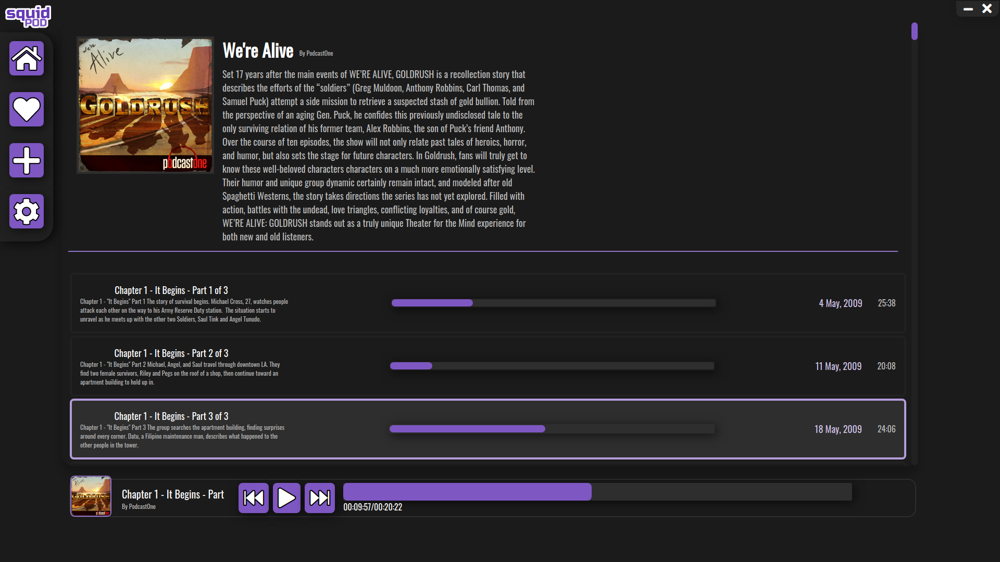
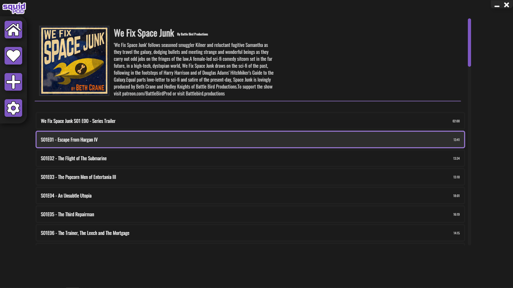

## What is SquidPod?

SquidPod is an easy to use podcast manager for the modern podcast junkie. Written in Javascript and built on [electron](https://www.electronjs.org/) with functionality and simplicity in mind, just add your favorite podcasts and start listening!

## Running

make sure a version of `electron` is installed, then run `electron .` in the top most directory.
